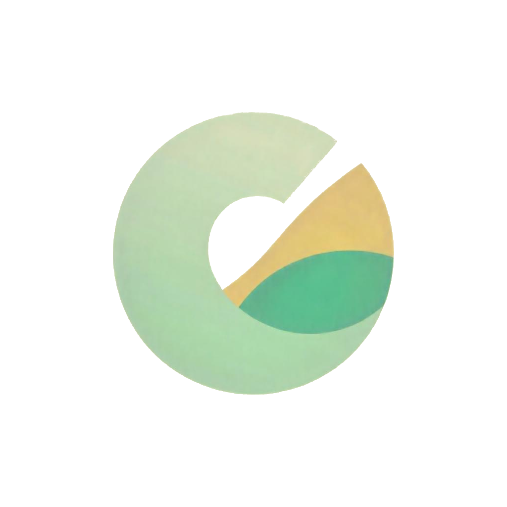

# Dagent

<p align="center">
  
</p>


  

**Dagent** es un **script en Python** que facilita la gestión de **clientes y ventas** en una base de datos. Este script te permite ingresar y almacenar información de clientes y ventas de manera rápida y sencilla.


---

###  Funciones

- **Gestión de clientes**
- **Gestión de ventas**
- **Fácil de usar**

---

### Estructura del proyecto

---

```
app
├─ LICENSE
├─ README.md
└─ main
   ├─ SQlite
   │  ├─ Iniciador.py
   │  └─ iniciador2.py
   ├─ Testing
   │  ├─ controlador
   │  │  ├─ busqueda_c.py
   │  │  ├─ entrada.py
   │  │  ├─ menu.py
   │  │  ├─ update_client.py
   │  │  └─ validacion.py
   │  ├─ modelo
   │  │  ├─ busqueda.py
   │  │  ├─ busqueda2.py
   │  │  ├─ consulta.py
   │  │  ├─ modelo.py
   │  │  ├─ modelo2.py
   │  │  ├─ setting.py
   │  │  ├─ testing
   │  │  └─ testing.db
   │  ├─ other
   │  │  ├─ SQlite
   │  │  │  ├─ Iniciador.py
   │  │  │  └─ SQlite
   │  │  │     └─ Iniciador.py
   │  │  ├─ freepik__an-elegant-logo-for-revenue-management-with-a-focu__86848.png
   │  │  ├─ login.py
   │  │  ├─ poo.py
   │  │  ├─ poo2.py
   │  │  ├─ poo3.py
   │  │  └─ poo4.py
   │  └─ vista
   │     ├─ cliente.py
   │     ├─ page.py
   │     └─ welcome.py
   └─ page.py

```


---

### Clonar repositorio

```
git clone https://github.com/wh1te-fox/Projec-db.git
```

---

### Tecnologías Usadas

Este scrip utiliza las siguientes tecnologías:

- 
- 
- 

---

### Clona este repositorio

```bash
git clone https://github.com/wh1te-fox/Projec-db.git
````

---

### Dependencias

```bash
pip install flet[all]
```

---

### Licencia

Este proyecto está bajo la Licencia GPL-3.0 - ver el archivo [LICENSE](https://github.com/wh1te-fox/Projec-db?tab=GPL-3.0-1-ov-file) para más detalles.
