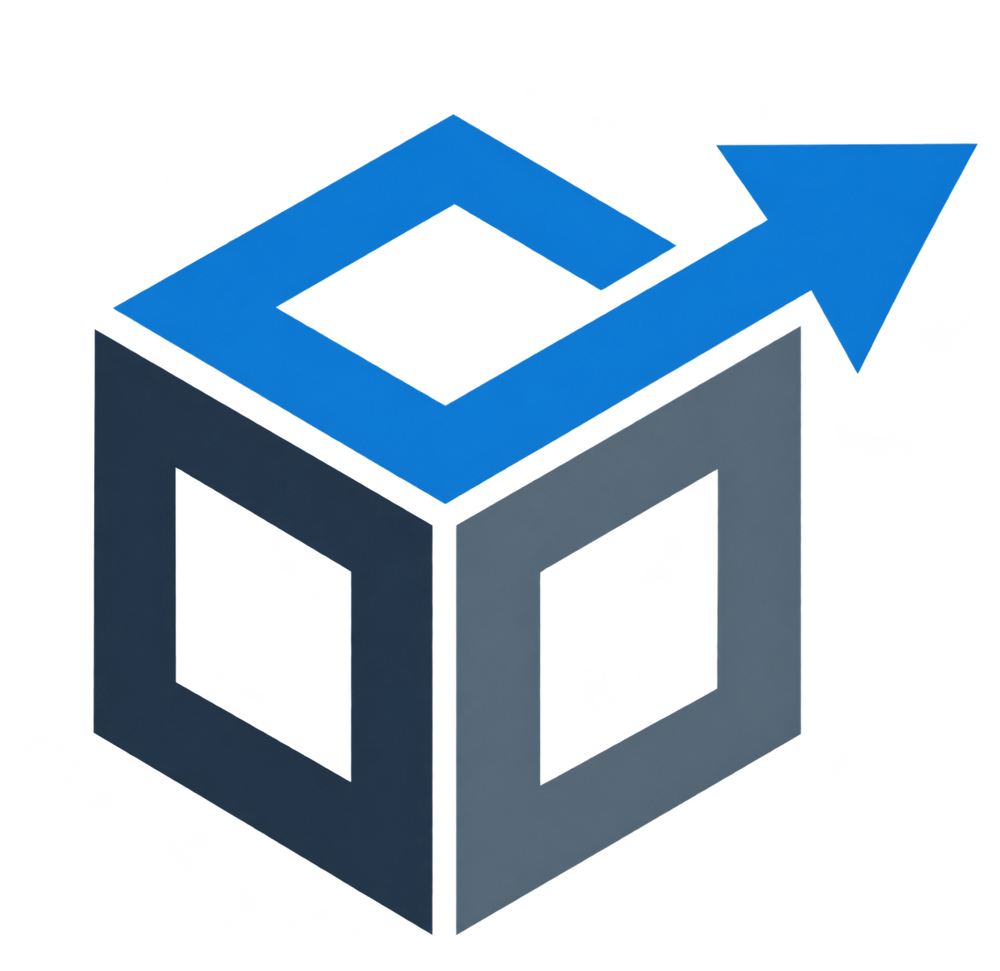

<a id="readme-top"></a>

<div align="center">

  

  # Dagent

  **Sistema ágil y ligero para la gestión de clientes y ventas**

  [](https://github.com/wh1te-fox/Dagent)
  [](https://www.python.org/)
  [](https://flet.dev/)
  [](LICENSE)

  <p align="center">
    <a href="#-características">Características</a> •
    <a href="#-tecnologías">Tecnologías</a> •
    <a href="#-instalación">Instalación</a> •
    <a href="#-novedades">Novedades</a>
  </p>

</div>

---

> **Espacio de Experimentación:** Este repositorio está dedicado a la exploración, validación y optimización de tecnologías. Si tienes propuestas de mejora o nuevas funcionalidades, ¡las contribuciones son bienvenidas!

---

## Características

-  **Gestión de Clientes:** Registro, actualización y búsqueda centralizada de clientes.
-  **Control de Ventas:** Registro de transacciones y catálogo de productos.
-  **Interfaz Moderna:** Experiencia multiplataforma fluida construida sobre Flet.
-  **Almacenamiento Local:** Integración ligera y veloz con SQLite.

---

##  Tecnologías

| Tecnología | Descripción |
| :--- | :--- |
|  | Lenguaje base (v3.12+) |
|  | Framework para interfaz gráfica (UI) |
|  | Motor de base de datos relacional |

---

## Instalación

Sigue estos pasos para clonar y ejecutar el proyecto localmente:

### 1. Clonar el repositorio
```bash
git clone git@github.com:wh1te-fox/Dagent.git
cd Dagent

```

### 2. Configurar el entorno virtual

```bash
# Linux / macOS
python3 -m venv venv
source venv/bin/activate

# Windows
python -m venv venv
venv\Scripts\activate

```

### 3. Instalar dependencias

```bash
pip install --upgrade pip
pip install -r requirements.txt

```

### 4. Ejecutar la aplicación

```bash
python src/page.py

```

---

##  Novedades (Rama Activa)

Las últimas actualizaciones integradas en la nueva rama incluyen:

*  **Consultas SQL optimizadas:** Refactorización en los módulos de búsqueda y productos (`Code/SQL/`).
*  **Mejoras en la interfaz:** Flujo de entrada de datos y actualización de clientes simplificados.
*  **Refactorización de código:** Modularización limpia de controladores y compatibilidad asegurada con Python 3.12+.

---

##  Licencia

Distribuido bajo la licencia **GPL-3.0**. Consulta el archivo [`LICENSE`](https://www.google.com/search?q=LICENSE) para obtener más información.
